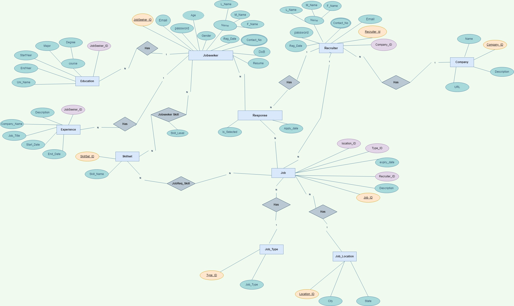

# Jobs4You (Backend)

This repository contains the backend implementation for a Job Portal project. The Job Portal Backend provides a robust platform for job seekers and recruiters to connect, facilitating the job search and recruitment process. It offers a range of features and functionalities to streamline the workflow of both job seekers and recruiters.
## Demo

https://jobs4you-hetavshah.vercel.app/

## Getting Started

To get started with the Job Portal Backend, follow these steps:
- Clone the repository: git clone https://github.com/HetavShah/jobportal 
- Install the dependencies: `npm install`
- Set up the Postgres database and update the database configuration in the .env file.
- Start the server: ` npm start`
## Screenshots

### Database E-R Diagram

## Features

### Jobseeker functionalities:
- Create, read, update, and delete resumes.
- Manage personal details, education details, experience details, and skill details.
- View a list of available jobs and apply to any job.
### Recruiter functionalities:
- Create, update, and delete profiles.
- Manage company details.Create, update, and delete job listings.
- View a list of jobseekers who have applied for each job.
- Select jobseekers for specific jobs.

## Tech Stack

- Node.js and Express.js for building the API.
- Sequelize ORM for efficient data management.
- Postgres as the database for data storage and retrieval.
- Postman for API testing.
- Bcrypt and JWT for authorization and password encryption.Heroku for deployment.
- Vercel for deployment.

